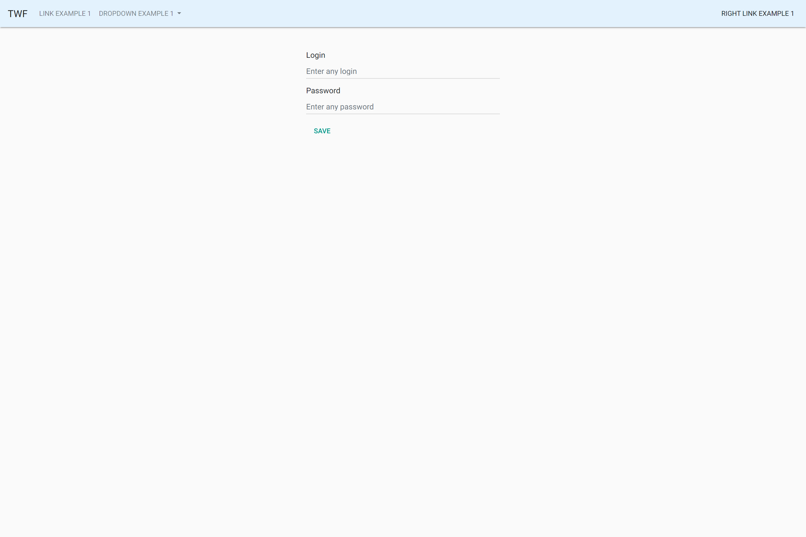
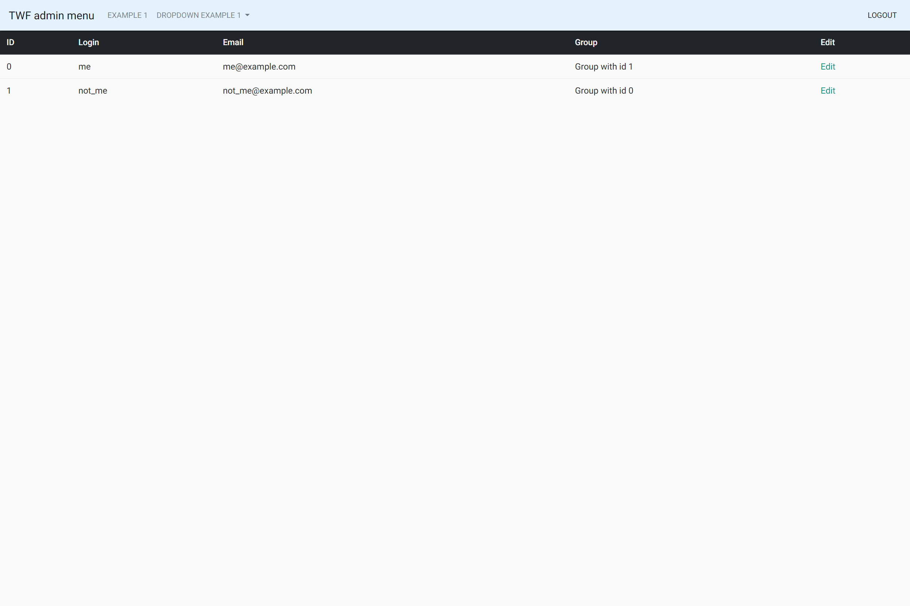
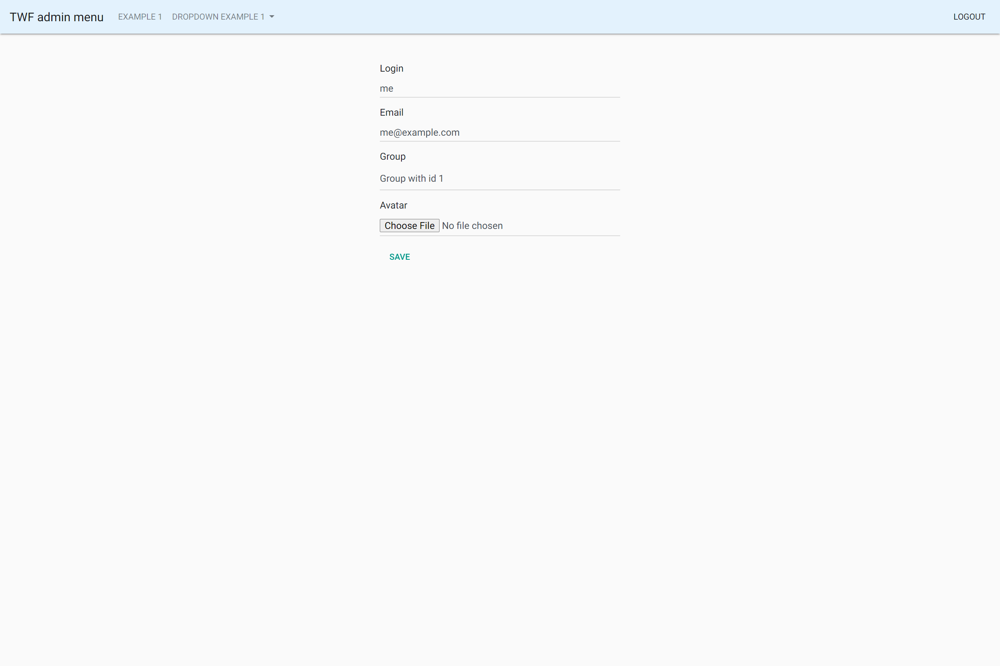

# TWF

Simple golang library for easily creating admin portals (or another web interfaces with many forms :)  )

## Usage

Add form example

```go
package main

import (
	"fmt"
	"github.com/gorilla/mux"
	"github.com/tochk/twf"
	"github.com/tochk/twf/twftemplates"
	"log"
	"net/http"
)

type Auth struct {
	// Login field in form - simple text field with name, title and placeholder described below
	Login string `twf:"name:login,title:Login,placeholder:Enter any login"`
	// Password field in form - password field with name, title and placeholder described below
	Password string `twf:"name:password,title:Password,type:password,placeholder:Enter any password"`
}

func indexHandler(w http.ResponseWriter, r *http.Request) {
	twfInstance := twf.New() // create new instance with default parameters

	twfInstance.FormFunc = twftemplates.MultipartForm // you should redefine twf.FormFunc to twftemplates.MultipartForm if you need to use file upload in forms

	// build add form
	data, err := twfInstance.AddForm("Login", &Auth{}, "")
	if err != nil {
		return
	}

	// print add form to user
	fmt.Fprint(w, data)
}

func main() {
	r := mux.NewRouter() // create router
	r.HandleFunc("/", indexHandler)

	if err := http.ListenAndServe(":8080", r); err != nil {
		log.Fatal(err)
	}
}
```

For more exaples go to [example](examples).

### Allowed tags

Tags format - comma-separated parameters in `twf` tag:

```go
type Test struct {
	ID string `twf:"name:id,title:ID"`
}
```

Important! TWF doesn't support escaping commas and other symbols in tags.

Tags:

- `name` format: `name:id` used in form as input internal name
- `title` format: `title:ID` used in form or table as column title
- `type` format: `type:textarea` used in form to determine input type, allowed values:
    - `textarea`
    - `password`
    - `number` - default for numeric types
    - `checkbox` - default for bool
    - `file` - use this type for marshal file from form to []byte type
    - `select` - default for fks
- `placeholder` format: `placeholder:Enter ID` used in form as placeholder
- `reqiured` format: `required` used as required flag in form
- `no_create` format: `no_create` disable showing in add form
- `no_edit` format: `no_edit` disable showing in edit form
- `no_show_in_table` format: `no_show_in_table` disable showing in table
- `process_parameters` format: `process_parameters` add template parameters to value (see [template parameters](#Template parameters))
- `value` format: `value:default value` default value
- `fks` format: `fks:0,id,name` fks info, (see [FKs](#FKs))

### Template parameters

If `process_parameters` is enabled replaces template parameters in value

For example, edit link in table: 

```go
type Test struct {
	ID   int    `twf:"title:ID,name:id"`
	Edit string `twf:"title:Edit,name:edit,value:<a href=\"/users/edit/{id}\">Edit</a>,no_create,no_edit,process_parameters"`
}
```

Edit will be printed in separate column and for id = 1 it will be `<a href="/users/edit/1">Edit</a>`

### FKs

Feature for linking another tables (by id, for example)

Example: [link](examples/users_page.go) `GroupID` field and `groups slice

## Example

Example docs: [link](examples/README.md)

To run the example:

`make run_example`

### Screenshots

#### Login form



#### Table view



#### Edit user form



## TODO

- Paging
- More tests
- Benchmarks